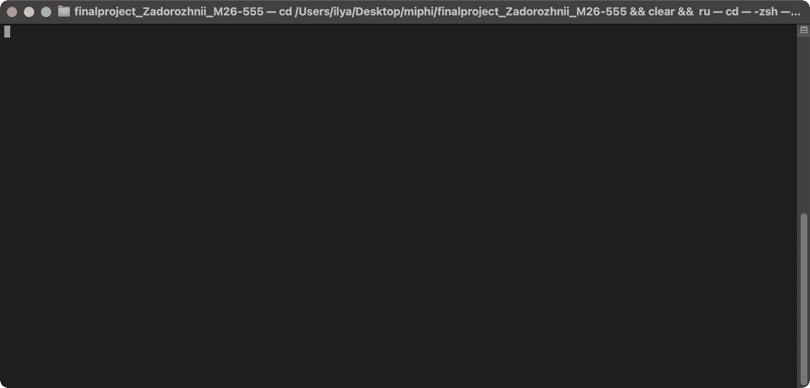

# ValutaTrade Hub

Учебный консольный кошелек для фиатных и криптовалют: регистрация, пополнение
виртуального USD-баланса, покупка, продажа и оценка портфеля по курсам
CoinGecko и ExchangeRate-API. Данные сохраняются в JSON, операции — в журнале.

**[Полное описание проекта](docs/README_FULL.md)** ·
[Проверка критериев](docs/assessment.md)

## Демо



66 секунд: регистрация и вход, обновление курсов, покупка и продажа,
просмотр портфеля и обработка ошибок. Записано в Terminal с реальными API.

[Открыть GIF](docs/demo.gif) · [Запись asciinema](docs/demo.cast) ·
[Текст сеанса](docs/demo.txt)

## Быстрый старт

Нужны **Python 3.12+** и **uv**. Выполняйте команды из папки проекта.

```bash
uv sync --locked
```

Создайте `.env` по шаблону [.env.example](.env.example) и укажите свой
`EXCHANGERATE_API_KEY`. Если файл уже настроен, используйте его.
`COINGECKO_API_KEY` можно оставить пустым, если публичный доступ работает.

```bash
uv run wallet
```

Далее вводите команды внутри приложения:

```text
register --username alice --password 1234
login --username alice --password 1234
deposit --amount 10000
update-rates
show-rates --top 2
buy --currency BTC --amount 0.005
sell --currency BTC --amount 0.002
show-portfolio
get-rate --from USD --to BTC
exit
```

`amount` — количество валюты; покупка списывает USD, продажа пополняет USD.
Справка доступна через `help`. Курсы хранятся в локальном кэше с TTL 5 минут;
для обновления используйте `update-rates`.

## Проверки

```bash
uv run ruff check .
uv run ruff format --check .
uv run python -m unittest discover -s tests -v
uv build
```

Все команды, архитектура, настройка API, форматы данных, логирование
и запись демо описаны в [полном README](docs/README_FULL.md).
